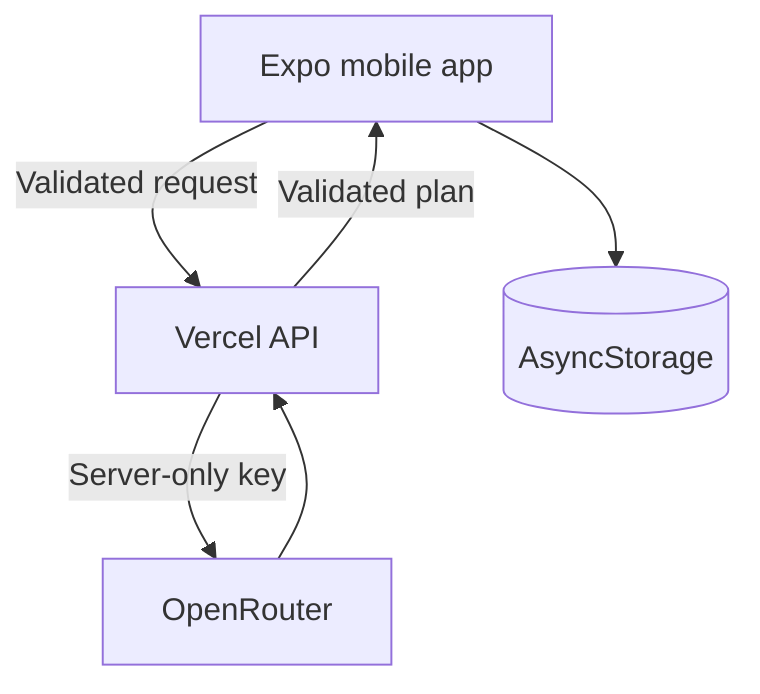

# Smart Step

Smart Step is an LLM-powered mobile wellness prototype built with Expo, React Native, and TypeScript. It creates personalized daily activities through a conversational AI coach and includes progress tracking, exercise videos, hydration reminders, GPS walking/running tracking, and a demo leaderboard.

> **Prototype only:** Smart Step is not medical advice. AI responses may be inaccurate, and plans for children should be reviewed by a responsible adult.

## Demo

[](docs/demo/SmartSteps.mp4)

▶️ **[Watch the 94-second mobile demo](docs/demo/SmartSteps.mp4)**

## Features

- AI wellness coach with short, guided questions
- Structured personalized activity plans
- Daily activity completion and points
- Persistent local progress with AsyncStorage
- Foreground GPS route, distance, and time tracking
- Hydration timer and exercise video
- Static demonstration leaderboard
- Child-friendly privacy and safety messaging

## AI architecture



The OpenRouter key stays in the server environment and is never included in the mobile app. Zod validates chat requests, AI responses, generated plans, and stored progress.

## Tech stack

- Expo SDK 53 and Expo Router
- React Native, React 19, and TypeScript
- Vercel Functions and OpenRouter
- Zod and AsyncStorage
- Expo Location and React Native Maps
- Vitest

## Run locally

### 1. Install dependencies

```bash
npm ci
```

### 2. Configure the API URL

Copy the environment template:

```bash
cp .env.example .env
```

Set the deployed API URL in `.env`:

```env
EXPO_PUBLIC_API_BASE_URL=https://your-api.vercel.app
```

`EXPO_PUBLIC_API_BASE_URL` is public configuration. Never place `OPENROUTER_API_KEY` in the Expo app.

### 3. Start the app

```bash
npm start
```

Scan the QR code with Expo Go or run:

```bash
npm run android
npm run ios
npm run web
```

GPS tracking works best on a physical phone.

## Deploy the AI endpoint

```bash
npx vercel
npx vercel env add OPENROUTER_API_KEY production
npx vercel --prod
```

Then use the deployed Vercel URL as `EXPO_PUBLIC_API_BASE_URL`.

For a public release, add authentication and platform-level rate limiting to the API.

## Validation

```bash
npm run lint
npm run typecheck
npm test
npx expo-doctor
```

Validated locally:

- ESLint passed
- TypeScript passed
- 11 unit tests passed
- Expo Doctor passed 18/18 checks
- Web and Android production exports passed

## Project structure

```text
api/chat.ts                       Secure OpenRouter API endpoint
app/                              Expo Router screens
components/ActivityMap.*          Native and web map implementations
contexts/UserProgressContext.tsx  Progress and personalized plan state
lib/                              Validation and core logic
lib/__tests__/                    Unit tests
services/chatApi.ts               Mobile API client
docs/demo/SmartSteps.mp4          Demo video
```

## Limitations

- The leaderboard contains static demo data.
- Hydration reminders are in-app timers, not system notifications.
- GPS tracking is foreground-only and is not fitness-grade measurement.
- The API needs authentication, rate limiting, and a formal privacy review before public production use.
- A real child-facing release requires parental consent, moderation, privacy compliance, and professional safety review.
