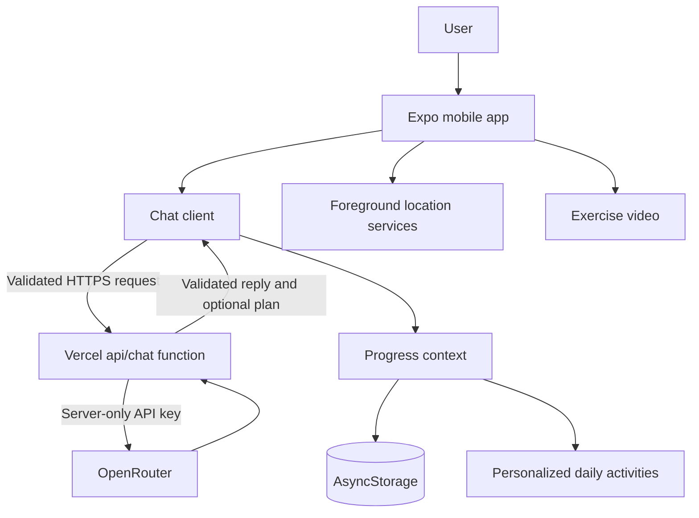

# Smart Step

Smart Step is an **LLM-powered mobile wellness prototype** built with Expo, React Native, and TypeScript. It combines a safety-oriented conversational coach with personalized daily activities, local progress tracking, exercise media, foreground GPS tracking, hydration reminders, and gamification.

> **Portfolio prototype — not medical advice.** Smart Step does not diagnose, treat, or replace a qualified professional. AI output can be wrong. Plans intended for children should be reviewed by a responsible adult. Do not enter names, addresses, school details, medical records, or precise locations in chat.

## Demo video

▶️ **[Watch the 94-second Smart Step mobile demo](docs/demo/SmartSteps.mp4)**

The portrait recording demonstrates the main mobile experience and is stored directly in this repository for convenient portfolio review.

## Highlights

- **Secure AI architecture:** OpenRouter credentials remain in a Vercel server function, never in the mobile bundle.
- **Structured AI output:** Shared Zod contracts validate requests, assistant replies, and generated wellness plans.
- **Plan-to-product loop:** Completed AI plans become the activities shown in the app instead of remaining unstructured chat text.
- **Local-first progress:** AsyncStorage hydration, daily score derivation using the local calendar date, duplicate prevention, and bounded completion history.
- **Foreground movement tracking:** Route display, elapsed active time, pause/resume behavior, and filtering for GPS jitter, poor accuracy, and implausible jumps.
- **Kid-friendly UX:** Onboarding recovery/skip controls, brief questions, visual activity cards, videos, scoring, and clear privacy messaging.
- **Quality checks:** TypeScript strict mode, ESLint, Expo Doctor, and unit tests for core AI contracts, routing, progress, and location logic.

## Architecture



The trusted wellness/safety prompt is defined in `api/chat.ts`. The app sends only user and assistant messages; it cannot supply or replace the server system prompt. Both sides use `lib/chat-contract.ts` to validate data.

## AI engineering demonstrated

- Server-side prompt design and safety boundaries.
- Separation of public mobile configuration from secret provider credentials.
- Structured JSON generation with runtime schema validation.
- Bounded message history, input lengths, output lengths, model tokens, and request timeouts.
- Stable upstream error mapping without exposing provider payloads.
- Client cancellation and user-friendly failure states.
- Converting model output into persisted application state.
- Explicit handling of child privacy and health-related limitations.

This project integrates an external LLM; it does **not** claim to train or fine-tune a machine-learning model.

## Tech stack

- Expo SDK 53 and Expo Router 5
- React Native 0.79 and React 19
- TypeScript 5.8 in strict mode
- Vercel Functions and OpenRouter
- Zod 4 runtime validation
- AsyncStorage
- Expo Location and React Native Maps
- Expo Video and React Native WebView
- Vitest

## Project structure

```text
api/chat.ts                       Server-only OpenRouter proxy and safety prompt
app/                              Expo Router screens
  (tabs)/activities.tsx           Personalized activities and hydration timer
  (tabs)/leaderboard.tsx          Demo leaderboard
  chat.tsx                        AI coach UI
  onboarding.tsx                  Recoverable video onboarding
  walking-tracker.tsx             Foreground GPS activity tracker
  video-player.tsx                Exercise video screen
constants/activities.ts           Default fallback activities
contexts/UserProgressContext.tsx  Validated persistence and plan state
lib/chat-contract.ts              Shared Zod API schemas
lib/progress.ts                   Pure daily-progress logic
lib/location.ts                   Distance and GPS filtering logic
lib/start-route.ts                Hydration-aware startup routing
lib/__tests__/                    Core unit tests
services/chatApi.ts               Mobile API client
docs/demo/SmartSteps.mp4          Mobile walkthrough video
```

## Local setup

### Prerequisites

- Node.js 20+ (the project was validated with Node 22)
- npm
- Expo Go or an Android/iOS development environment
- An OpenRouter account for the AI feature

### Install

```bash
npm ci
```

### Configure environment variables

Copy the template:

```bash
cp .env.example .env
```

Variables:

| Variable | Location | Visibility | Description |
| --- | --- | --- | --- |
| `EXPO_PUBLIC_API_BASE_URL` | Expo `.env` / EAS | Public | Base URL hosting this repository's `/api/chat` function |
| `OPENROUTER_API_KEY` | Vercel only | Secret | OpenRouter provider credential |
| `OPENROUTER_MODEL` | Vercel only | Server config | Optional model override; defaults to `openai/gpt-4o-mini` |
| `APP_ORIGIN` | Vercel only | Server config | Allowed web origin and OpenRouter referer |

Never use `EXPO_PUBLIC_` for a secret. Expo public variables are included in the app bundle.

### Run the API locally

Install/authenticate the Vercel CLI and start the server function:

```bash
npx vercel dev
```

Set `OPENROUTER_API_KEY` in Vercel's local environment when prompted. For a physical phone, set `EXPO_PUBLIC_API_BASE_URL` to a URL the phone can reach; `localhost` refers to the phone itself, not your computer. Deploying the API first is usually simplest.

### Run the app

```bash
npm start
```

Then scan the QR code with Expo Go, or use:

```bash
npm run android
npm run ios
npm run web
```

Location behavior is best evaluated on a physical device.

## Validation

```bash
npm run lint
npm run typecheck
npm test
npx expo-doctor
```

Current local validation:

- ESLint: passed
- TypeScript: passed
- Vitest: 11 tests passed
- Expo Doctor: 18/18 checks passed
- Expo web production export: passed
- Expo Android production export: passed

## Deploy the API to Vercel

1. Revoke any provider credential that has previously appeared in client source or a shared build.
2. Run `npx vercel` in the repository and link/create a project.
3. Add `OPENROUTER_API_KEY` as a Vercel secret.
4. Optionally set `OPENROUTER_MODEL` and `APP_ORIGIN`.
5. Deploy with `npx vercel --prod`.
6. Set the resulting origin as `EXPO_PUBLIC_API_BASE_URL` in the Expo/EAS environment.

For a public production endpoint, also configure platform-level authentication and rate limiting (for example Vercel Firewall or a durable rate-limit store). A prompt is not a substitute for moderation, parental consent, privacy review, or child-safety compliance.

## Build an Android showcase APK

Authenticate and link the Expo project:

```bash
npx eas-cli@latest login
npx eas-cli@latest init
```

Set the public API URL for preview builds, then build using the included `eas.json`:

```bash
npx eas-cli@latest env:create --environment preview --name EXPO_PUBLIC_API_BASE_URL
npx eas-cli@latest build --platform android --profile preview
```

Add the resulting install URL to this README before sharing the installable preview.

## Showcase assets

The repository includes a [94-second mobile demo video](docs/demo/SmartSteps.mp4).

For additional visual context, create `docs/screenshots/` and add screenshots without real chat text or precise routes:

| AI coach | Personalized activities | Walk tracker | Leaderboard |
| --- | --- | --- | --- |
| Add screenshot | Add screenshot | Add screenshot | Add screenshot |

Possible additions:

- The EAS preview APK link.
- Curated screenshots for quick scanning.
- A hosted video mirror if inline playback is preferred.

## Privacy and safety

- Chat text is sent to the configured API and external model provider. Review provider retention terms before real-world use.
- Foreground GPS coordinates remain in screen state and are not sent to the AI endpoint.
- Progress and generated plans are stored locally on the device.
- The app intentionally does not request microphone or background-location permission.
- The leaderboard uses static fictional demo data; there are no real accounts or rankings.
- A real child-facing release requires parental consent, a privacy policy, moderation/escalation controls, data-retention decisions, authentication, abuse prevention, accessibility testing, and legal review.

## Known limitations

- The API endpoint needs deployment-level authentication/rate limiting before public production use.
- Hydration reminders are in-app timers, not scheduled operating-system notifications.
- Tracking is foreground-only and is not a medical- or fitness-grade measurement.
- Activity completion remains a user confirmation rather than verified exercise compliance.
- The exercise screen uses a network-hosted YouTube video.
- The leaderboard is demonstration data.
- Automated tests cover pure core logic, not full device UI interactions.
- `npm audit` reports transitive Expo SDK 53/Metro advisories whose automated fix requires breaking upgrades to newer Expo and React Native versions; do not use `npm audit fix --force` without planning that migration.

## Portfolio description

> Built an LLM-powered React Native wellness prototype with a secure Vercel/OpenRouter architecture, server-side safety prompting, Zod-validated structured plans, persistent personalized activities, foreground GPS tracking, and automated tests.
